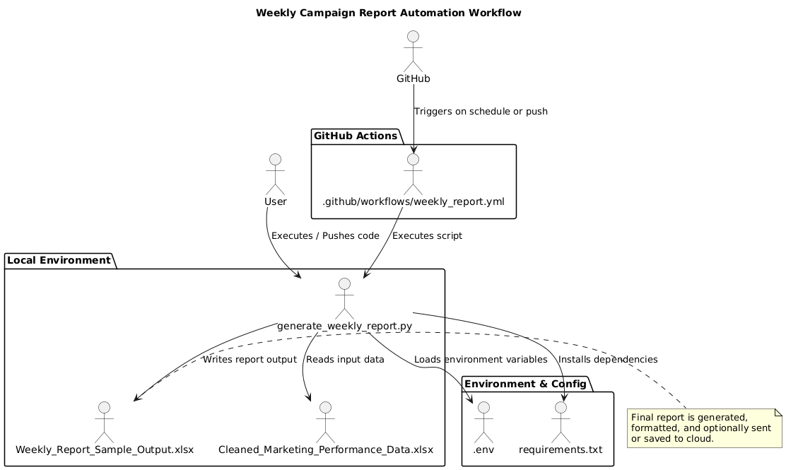

# 🧠 SMGroup Assignment – Automated Campaign Performance Report

---

## 📊 Project Overview

This project automates the generation of a **Weekly Campaign Performance Report** from a cleaned marketing dataset. The script processes the data, performs analysis, and exports a structured Excel report summarizing key metrics such as CTR, CPA, conversion rate, and top-performing campaigns.

It is scheduled to run automatically using **GitHub Actions**, making the workflow fully autonomous and production-ready.

---

📌 Live Demo: [Open Link](https://influencer-insights.streamlit.app)

---

## 🔁 Project Workflow



---

## 🚀 Features

- Reads and processes marketing campaign data from `.xlsx`
- Calculates weekly performance metrics
- Highlights top campaigns and major drop-offs
- Generates a formatted Excel report
- Fully automated using GitHub Actions scheduler
- Modular and easy to configure

---

## 🧩 Project Structure

```
Part4/
│
├── generate_weekly_report.py        # Main script to generate the report
├── Cleaned_Marketing_Performance_Data.xlsx  # Input data
├── Weekly_Report_Sample_Output.xlsx # Sample output
├── .env                             # Environment variables (if any)
├── requirements.txt                 # Python dependencies
└── .github/
    └── workflows/
        └── weekly_report.yml        # GitHub Actions workflow for scheduling
```

---

## ⚙️ Tech Stack

- **Python** (pandas, openpyxl, matplotlib)
- **Excel** for report generation
- **GitHub Actions** for automation
- **PlantUML** for workflow visualization

---

## 🛠️ Setup Instructions

1. Clone the repository:
   ```bash
   git clone https://github.com/khanfaisal79960/SMGroup_Assignment.git
   cd SMGroup_Assignment
   ```

2. Install dependencies:
   ```bash
   pip install -r requirements.txt
   ```

3. (Optional) Set environment variables in `.env` if needed

4. Run locally:
   ```bash
   python generate_weekly_report.py
   ```

5. Push to GitHub to trigger the scheduled action (or wait for CRON schedule)

---

## 🙋‍♂️ Author & Portfolio

Made with ❤️ by **Khan Faisal**  
🌐 Portfolio: [khanfaisal.netlify.app](https://khanfaisal.netlify.app)

---
